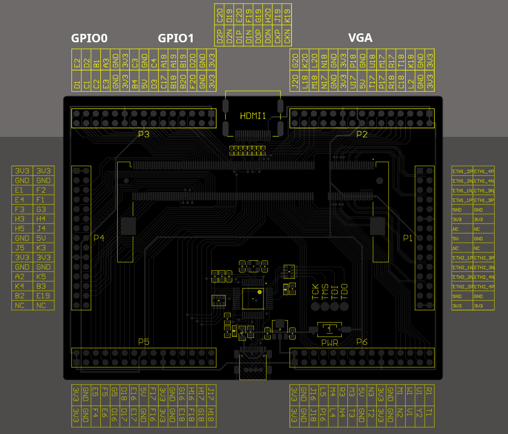

# IttyBitty for ECP5

This project instantiates an IttyBitty16 core into a SoC that includes:

   - 16 bidirectional GPIO lines
   - 1ms tick timer
   - 80x25 text mode
   - 32KB of RAM
   - 230.4Kbaud 8N1 UART
   - Depending on my mood it's configured for 60 or 64MHz with a 2-cycle ALU.

## Files

   - **ib16.v**: The top that implements the bus controller and wires up all of the blocks
   - **Makefile**: Build script
   - **ib16.lpf**: Pin constraints 

## Configuration

   - **FREQ**: The clockrate in MHz
   - **BLOCKS**: The number of 2KiB blocks to use for the main memory

## Build

This project brings in code from all over the repo:

   - IB16:
      - from **lib/ib16**:
          - **ib16_v2.v**: The ib16 core
   - UART:
      - from **lib/uart/blocks**:
          - **tx_uart.v**: UART Transmitter
          - **rx_uart.v**: UART Receiver
          - **uart.v**: UART Transceiver with FIFO
   - BRAM:
      - from **icesugarpro/lib/bram**:
          - **bram_dp_2048x8.v**: Dual-ported 2048x8 bits memory (used by N by wrapper and text mode driver)
          - **bram_dp_nx2048v8.v**: Dual-ported N by 2048x8 bits memory (used for main memory)
   - VGA:
      - from **lib/vga/blocks**:
          - **vga_timing.v**: Generates VGA clocks and signals
          - **8x8_font_256.v**: The 256 symbol 8x8 CP437 font.
          - **vga_text_driver.v**: The 80x25 monochrome text driver
          
## Pin Constraints

This demo is meant for the Colorlight i9 (v7.2) Lattice ECP5 board and uses the P3 and P2 header blocks located
to the left and right of the DVI header.

   - **GPIO0**: Uses the PMOD from P3 in the corner (next to P4)
   - **GPIO1**: Uses the PMOD from P3 next to the DVI header
   - **VGA**: Uses all of P2
   

## Memory Layout

   - **0000..`BLOCKS * 16'h0800**: Main Memory
   - **E800..EFFF**: Video memory in row major order, 80 columns x 25 rows of 1 byte per character CP437 text
   - **F000..F0FF**: Boot ROM (**boot_rom_ecp5.s**)
   - **FFF9**: Reading returns the current 1ms tick counter, writing anything will reset the timer/counter
   - **FFFA**: GPIO1, uses 8574 style interface where writing a 1 bit turns it into a pull up high impedance input.
   - **FFFB**: GPIO0, like GPIO1
   - **FFFC**: Interrupt Pending 
      - layout: [0, 0, 0, 0, VSYNC, TIMER, UART TX EMPTY, UART RX READY]
      - Write 1 to clear
      - Timer is the 1ms tick counter, interrupts every millisecond
   - **FFFD**: Interrupt enable (same bit layout as pending)
      - Defaults to all zero
   - **FFFE**: UART Status
      - [0, 0, 0, 0, 0, TX FIFO EMPTY, TX FIFO FULL, RX READY]
   - **FFFF**: UART Data
      - Blocks on read if !RX_READY, and on write if TX_FIFO_FULL

## Boot ROM

   - Located at F000
   - Uses **boot_rom_ecp5.s** from ib16 lib directory
   - Waits for 0x5A byte
   - Then reads 1 byte indicating the # of 256 byte pages
   - Then for the first 256 bytes it echoes them back after each received byte (to test the link)
   - After that it just reads the remaining 256 byte pages
   - Writes from 0000 upwards
   - Jumps to 0000 when done
   
## Setting Up

With OSS CAD Suite installed and configured you can SRAM program the FPGA with **make sram**.  To build and upload the firmware:

   - in lib/ib16:
       - **make upload ecp5_demo.s.bin**
       - **./upload /dev/ttyACM0 ecp5_demo.s.bin**

The demo uses the VGA output but input via UART so connect something like **minicom**.  There might be IRQ firing between prompts meaning you need to hit a key to see the demo progress.

