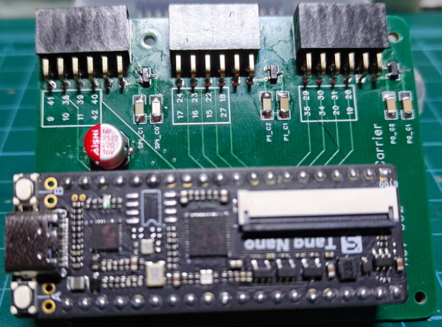

Tang Nano 1K Carrier Board
==========================



The carrier board accepts a Tang Nano 1K and maps 24 GPIO pins to three dual PMOD headers.  Each PMOD header has it's own 3.3 volt linear regulator.  Two of the PMODs (the two on the bottom furthest from the large capacitor) should be able to handle relatively fast signals while the other PMOD shares pins with onboard LEDs meaning high frequency signals might round off on them.  

Power
-----

The setup is powered via the USB-C header on the Nano1K.  The board uses a DSS24 diode and PTC with a 500mA hold current to provide a 5 volt rail that is then sent to the 3.3 volt linear regulators per PMOD port.  PMODs that bring their own supply is fine as long as you common the ground and the ICs are 3.3 volt tolerant.  All of the GPIO are on 3.3 volt I/O banks.  

Pinout
------

The following constraint file maps all the PMOD ports.  gpio[7:0] maps to the "slow" PMOD where some pins share pins with the LEDs.  The gpio[23:8] pins map to higher speed pins.  The pin mapping is top row next to GND to the end of the top and then same on the bottom.  


```nano1k_carrier.cst
// TOP: VCC GND 42 11 10 9
// BOT: VCC GND 40 39 38 41
IO_LOC "gpio[7]" 41; 
IO_PORT "gpio[7]" IO_TYPE=LVCMOS33 PULL_MODE=UP  BANK_VCCIO=3.3;
IO_LOC "gpio[6]" 38;
IO_PORT "gpio[6]" IO_TYPE=LVCMOS33 PULL_MODE=UP  BANK_VCCIO=3.3;
IO_LOC "gpio[5]" 39;
IO_PORT "gpio[5]" IO_TYPE=LVCMOS33 PULL_MODE=UP  BANK_VCCIO=3.3;
IO_LOC "gpio[4]" 40;
IO_PORT "gpio[4]" IO_TYPE=LVCMOS33 PULL_MODE=UP  BANK_VCCIO=3.3;
IO_LOC "gpio[3]" 9;
IO_PORT "gpio[3]" IO_TYPE=LVCMOS33 PULL_MODE=UP  BANK_VCCIO=3.3;
IO_LOC "gpio[2]" 10; // green
IO_PORT "gpio[2]" IO_TYPE=LVCMOS33 PULL_MODE=UP  BANK_VCCIO=3.3;
IO_LOC "gpio[1]" 11; // blue
IO_PORT "gpio[1]" IO_TYPE=LVCMOS33 PULL_MODE=UP  BANK_VCCIO=3.3;
IO_LOC "gpio[0]" 42; // red
IO_PORT "gpio[0]" IO_TYPE=LVCMOS33 PULL_MODE=UP  BANK_VCCIO=3.3;

// TOP: VCC GND 27 15 16 17
// BOT: VCC GND 18 22 23 24
IO_LOC "gpio[15]" 24; 
IO_PORT "gpio[15]" IO_TYPE=LVCMOS33 PULL_MODE=UP  BANK_VCCIO=3.3;
IO_LOC "gpio[14]" 23;
IO_PORT "gpio[14]" IO_TYPE=LVCMOS33 PULL_MODE=UP  BANK_VCCIO=3.3;
IO_LOC "gpio[13]" 22;
IO_PORT "gpio[13]" IO_TYPE=LVCMOS33 PULL_MODE=UP  BANK_VCCIO=3.3;
IO_LOC "gpio[12]" 18;
IO_PORT "gpio[12]" IO_TYPE=LVCMOS33 PULL_MODE=UP  BANK_VCCIO=3.3;
IO_LOC "gpio[11]" 17;
IO_PORT "gpio[11]" IO_TYPE=LVCMOS33 PULL_MODE=UP  BANK_VCCIO=3.3;
IO_LOC "gpio[10]" 16;
IO_PORT "gpio[10]" IO_TYPE=LVCMOS33 PULL_MODE=UP  BANK_VCCIO=3.3;
IO_LOC "gpio[9]" 15;
IO_PORT "gpio[9]" IO_TYPE=LVCMOS33 PULL_MODE=UP  BANK_VCCIO=3.3;
IO_LOC "gpio[8]" 27;
IO_PORT "gpio[8]" IO_TYPE=LVCMOS33 PULL_MODE=UP  BANK_VCCIO=3.3;

// TOP: VCC GND 19 20 34 35
// BOT: VCC GND 28 31 30 29
IO_LOC "gpio[23]" 29; 
IO_PORT "gpio[23]" IO_TYPE=LVCMOS33 PULL_MODE=UP  BANK_VCCIO=3.3;
IO_LOC "gpio[22]" 30;
IO_PORT "gpio[22]" IO_TYPE=LVCMOS33 PULL_MODE=UP  BANK_VCCIO=3.3;
IO_LOC "gpio[21]" 31;
IO_PORT "gpio[21]" IO_TYPE=LVCMOS33 PULL_MODE=UP  BANK_VCCIO=3.3;
IO_LOC "gpio[20]" 28;
IO_PORT "gpio[20]" IO_TYPE=LVCMOS33 PULL_MODE=UP  BANK_VCCIO=3.3;
IO_LOC "gpio[19]" 35;
IO_PORT "gpio[19]" IO_TYPE=LVCMOS33 PULL_MODE=UP  BANK_VCCIO=3.3;
IO_LOC "gpio[18]" 34;
IO_PORT "gpio[18]" IO_TYPE=LVCMOS33 PULL_MODE=UP  BANK_VCCIO=3.3;
IO_LOC "gpio[17]" 20;
IO_PORT "gpio[17]" IO_TYPE=LVCMOS33 PULL_MODE=UP  BANK_VCCIO=3.3;
IO_LOC "gpio[16]" 19;
IO_PORT "gpio[16]" IO_TYPE=LVCMOS33 PULL_MODE=UP  BANK_VCCIO=3.3;
```

Parts
-----

The BOM includes fairly simple parts

```
7, 1206 X7R 100nF
1, SMD  470uF (6.6mm x 6.6mm)
1, 1210 500mA Ih 16V PTC FUSE (I used: 0ZCH0050FF2G)
3, SOT-23-3 3.3v 250mA LDO LIN REG
3, 12P 2x6 2.54mm x 2.54mm RIGHT ANGLE FEMALE HDR (digi: 732-613012243121-ND)
1, DSS24 DIODE
2, 20P 2.54mm FEMALE HDR
```